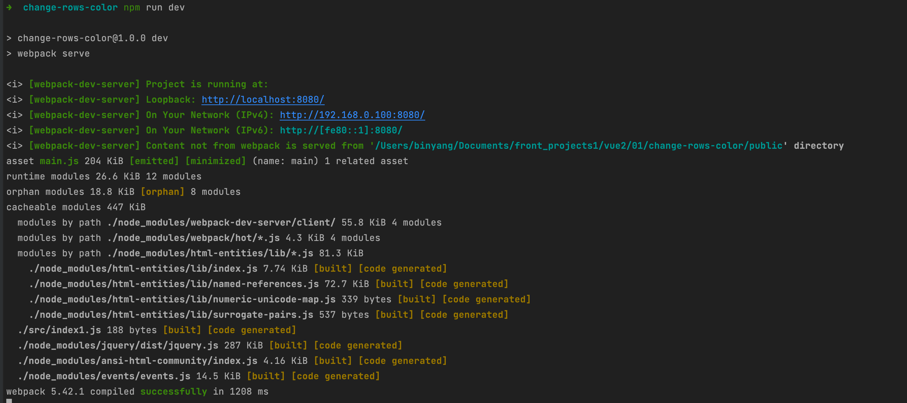
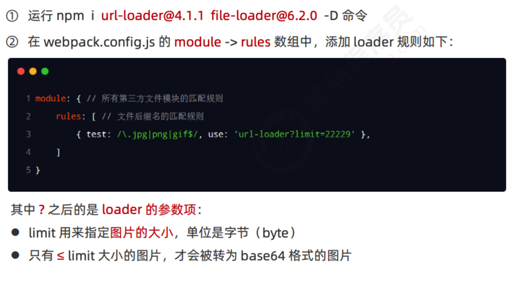
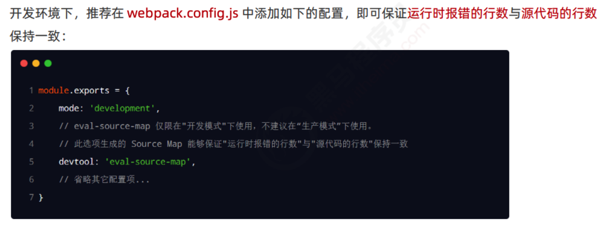
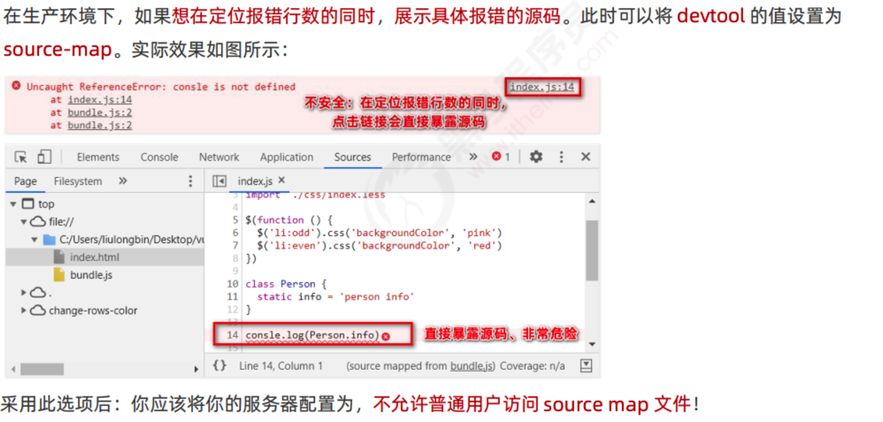

## webpack

### 基本使用

隔行变色小demo

代码写完后发现不能实现效果

这是因为没有安装webpack进行打包编译，浏览器不识别ES6的高级语法

 

[npm (npmjs.com)](https://www.npmjs.com/)

在项目中配置 webpack

运行完后多了dist文件

webpack 中的默认约定

### 插件

每次改代码都要重新 npm run dev，有什么方便的方法自动打包改善体验呢？webpack 插件webpack-dev-server

npm install webpack-dev-server@3.11.2 -D

查看webpack各个包的版本

解决报错：Unable to load '@webpack-cli/serve' command，原因：webpack-cli版本不匹配，解决：重装webpack(npm i -D webpack-cli)

生产http监听的main.js(存在内存中)

运行如下的命令，即可在项目中安装此插件： npm install html-webpack-plugin@5.3.2 -D

配置 html-webpack-plugin

 devServer 节点

### loader

loader 概述

 loader 的调用过程

打包处理 css 文件

① 运行 npm i style-loader@3.0.0 css-loader@5.2.6 -D 命令，安装处理 css 文件的 loader ② 在 webpack.config.js 的 module -> rules 数组中，添加 loader 规则如下：

其中，test 表示匹配的文件类型， use 表示对应要调用的 loader 注意：

 ⚫ use 数组中指定的 loader 顺序是固定的 

 ⚫ 多个 loader 的调用顺序是：从后往前调用

 打包处理 less 文件

打包处理样式表中与 url 路径相关的文件

打包处理 js 文件中的高级语法

运行如下的命令安装对应的依赖包：

npm i babel-loader@8.2.2 @babel/core@7.14.6 @babel/plugin-proposal-decorators@7.14.5 -D

配置 babel-loader

详情请参考 Babel 的官网 https://babeljs.io/docs/en/babel-plugin-proposal-decorators

### 打包发布

 把 JavaScript 文件统一生成到 js 目录中

把图片文件统一生成到 image 目录中

自动清理 dist 目录下的旧文件

### Source Map

生产环境遇到的问题

什么是 Source Map

 

 解决默认 Source Map 的问题

 webpack 生产环境下的 Source Map

只定位行数不暴露源码

定位行数且暴露源码

  

实际开发中需要自己配置 webpack 吗？

