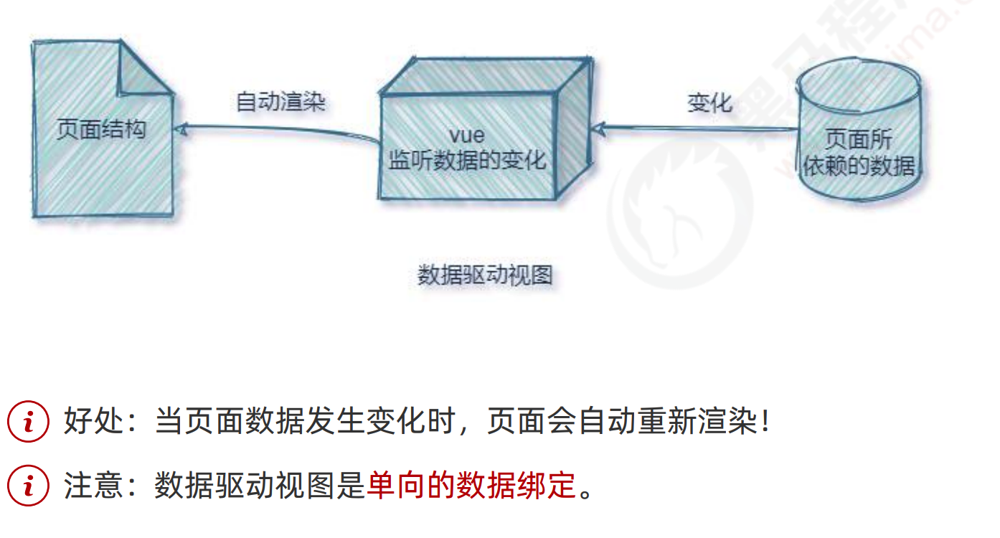

# Vue2_02


## 1.Vue简介

### 1.1.vue 的特性

vue 框架的特性，主要体现在如下两方面： ① 数据驱动视图 ② 双向数据绑定

在使用了 vue 的页面中，vue 会监听数据的变化，从而自动重新渲染页面的结构。示意图如下：



双向数据绑定

在填写表单时，双向数据绑定可以辅助开发者在不操作 DOM 的前提下，自动把用户填写的内容同步到数据源 中。示意图如下：


### 1.2.MVVM

MVVM 是 vue 实现数据驱动视图和双向数据绑定的核心原理。MVVM 指的是 Model、View 和 ViewModel， 它把每个 HTML 页面都拆分成了这三个部分，如图所示：


## 2.vue 的基本使用

基本使用步骤

```html
<body>
  <!-- 希望 Vue 能够控制下面的这个 div，帮我们在把数据填充到 div 内部 -->
  <div id="app">{{ username }}</div>

  <!-- 1. 导入 Vue 的库文件，在 window 全局就有了 Vue 这个构造函数 -->
  <script src="./lib/vue-2.6.12.js"></script>
  <!-- 2. 创建 Vue 的实例对象 -->
  <script>
    // 创建 Vue 的实例对象
    const vm = new Vue({
      // el 属性是固定的写法，表示当前 vm 实例要控制页面上的哪个区域，接收的值是一个选择器
      el: '#app',
      // data 对象就是要渲染到页面上的数据
      data: {
        username: 'zhangsan'
      }
    })
  </script>
</body>
```

基本代码与 MVVM 的对应关系


## 3.vue 的指令与过滤器

### 3.1.指令的概念

指令（Directives）是 vue 为开发者提供的模板语法，用于辅助开发者渲染页面的基本结构。

vue 中的指令按照不同的用途可以分为如下 6 大类：

 ① 内容渲染指令 ② 属性绑定指令 ③ 事件绑定指令 ④ 双向绑定指令 ⑤ 条件渲染指令 ⑥ 列表渲染指令

注意：指令是 vue 开发中最基础、最常用、最简单的知识点。

### 3.2 内容渲染指令

内容渲染指令用来辅助开发者渲染 DOM 元素的文本内容。常用的内容渲染指令有如下 3 个： 

① v-text ② {{ }} ③ v-html vue

```html
<body>
<!-- 希望 Vue 能够控制下面的这个 div，帮我们在把数据填充到 div 内部 -->
<div id="app">
  <p v-text="username"></p>
  <p v-text="gender">性别：</p>

  <hr>
  <!--vue 提供的 {{ }} 语法，专门用来解决 v-text 会覆盖默认文本内容的问题。这种 {{ }} 语法的专业名称是插值表达
  式（英文名为：Mustache）-->
  <p>姓名：{{ username }}</p>
  <p>性别：{{ gender }}</p>

  <hr>

  <div v-text="info"></div>
  <div>{{ info }}</div>
  <!--v-text 指令和插值表达式只能渲染纯文本内容。如果要把包含 HTML 标签的字符串渲染为页面的 HTML 元素，
  则需要用到 v-html 这个指令-->
  <div v-html="info"></div>
</div>

<!-- 1. 导入 Vue 的库文件，在 window 全局就有了 Vue 这个构造函数 -->
<script src="./lib/vue-2.6.12.js"></script>
<!-- 2. 创建 Vue 的实例对象 -->
<script>
  // 创建 Vue 的实例对象
  const vm = new Vue({
    // el 属性是固定的写法，表示当前 vm 实例要控制页面上的哪个区域，接收的值是一个选择器
    el: '#app',
    // data 对象就是要渲染到页面上的数据
    data: {
      username: 'zhangsan',
      gender: '女',
      info: '<h4 style="color: red; font-weight: bold;">欢迎大家来学习 vue.js</h4>'
    }
  })
</script>
</body>
```

### 3.3属性绑定指令

如果需要为元素的属性动态绑定属性值，则需要用到 v-bind 属性绑定指令。由于 v-bind 指令在开发中使用频率非常高，因此，vue 官方为其提供了简写形式（简写为英文的 : ）。

```html
<body>
  <!-- 希望 Vue 能够控制下面的这个 div，帮我们在把数据填充到 div 内部 -->
  <div id="app">
    <input type="text" :placeholder="tips">
    <hr>
    <!-- vue 规定 v-bind: 指令可以简写为 : -->
    

    <hr>
    <div>1 + 2 的结果是：{{ 1 + 2 }}</div>
    <div>{{ tips }} 反转的结果是：{{ tips.split('').reverse().join('') }}</div>
    <div :title="'box' + index">这是一个 div</div>
    <p>{{ok ? 'YES' : 'No'}}</p>
  </div>

  <!-- 1. 导入 Vue 的库文件，在 window 全局就有了 Vue 这个构造函数 -->
  <script src="./lib/vue-2.6.12.js"></script>
  <!-- 2. 创建 Vue 的实例对象 -->
  <script>
    // 创建 Vue 的实例对象
    const vm = new Vue({
      // el 属性是固定的写法，表示当前 vm 实例要控制页面上的哪个区域，接收的值是一个选择器
      el: '#app',
      // data 对象就是要渲染到页面上的数据
      data: {
        tips: '请输入用户名',
        photo: 'https://cn.vuejs.org/images/logo.svg',
        index: 3,
        ok : true,
      }
    })
  </script>
</body>
```

### 3.4.事件绑定指令

vue 提供了 v-on 事件绑定指令，用来辅助程序员为 DOM 元素绑定事件监听。语法格式如下：


注意：原生 DOM 对象有 onclick、oninput、onkeyup 等原生事件，替换为 vue 的事件绑定形式后， 分别为：v-on:click、v-on:input、v-on:keyup

由于 v-on 指令在开发中使用频率非常高，因此，vue 官方为其提供了简写形式（简写为英文的 @ ）

```html
<body>
  <!-- 希望 Vue 能够控制下面的这个 div，帮我们在把数据填充到 div 内部 -->
  <div id="app">
    <p>count 的值是：{{ count }}</p>
    <!-- 在绑定事件处理函数的时候，可以使用 () 传递参数 -->
    <!-- v-on: 指令可以被简写为 @ -->
    <button @click="add(1)">+1</button>
    <button @click="sub">-1</button>
  </div>
  <!-- 1. 导入 Vue 的库文件，在 window 全局就有了 Vue 这个构造函数 -->
  <script src="./lib/vue-2.6.12.js"></script>
  <!-- 2. 创建 Vue 的实例对象 -->
  <script>
    // 创建 Vue 的实例对象
    const vm = new Vue({
      // el 属性是固定的写法，表示当前 vm 实例要控制页面上的哪个区域，接收的值是一个选择器
      el: '#app',
      // data 对象就是要渲染到页面上的数据
      data: {
        count: 0
      },
      // methods 的作用，就是定义事件的处理函数
      methods: {
        add(n) {
          // 在 methods 处理函数中，this 就是 new 出来的 vm 实例对象
          // console.log(vm === this)
          console.log(vm)
          // vm.count += 1
          this.count += n
        },
        sub() {
          // console.log('触发了 sub 处理函数')
          this.count -= 1
        }
      }
    })
  </script>
</body>
```

在原生的 DOM 事件绑定中，可以在事件处理函数的形参处，接收事件参数对象 event。同理，在 v-on 指令 （简写为 @ ）所绑定的事件处理函数中，同样可以接收到事件参数对象 event，示例代码如下：

```html
<body>
  <!-- 希望 Vue 能够控制下面的这个 div，帮我们在把数据填充到 div 内部 -->
  <div id="app">
    <p>count 的值是：{{ count }}</p>
    <!-- 如果 count 是偶数，则 按钮背景变成红色，否则，取消背景颜色 -->
    <!-- <button @click="add">+N</button> -->
    <!-- vue 提供了内置变量，名字叫做 $event，它就是原生 DOM 的事件对象 e -->
    <button @click="add($event, 1)">+N</button>
    <button @click="trigger">{{tip}}</button>
  </div>
  <!-- 1. 导入 Vue 的库文件，在 window 全局就有了 Vue 这个构造函数 -->
  <script src="./lib/vue-2.6.12.js"></script>
  <!-- 2. 创建 Vue 的实例对象 -->
  <script>
    // 创建 Vue 的实例对象
    const vm = new Vue({
      // el 属性是固定的写法，表示当前 vm 实例要控制页面上的哪个区域，接收的值是一个选择器
      el: '#app',
      // data 对象就是要渲染到页面上的数据
      data: {
        count: 0,
        tip: '变红'
      },
      methods: {
        add(e, n) {
          this.count += n
          console.log(e)

          // 判断 this.count 的值是否为偶数
          if (this.count % 2 === 0) {
            // 偶数
            e.target.style.backgroundColor = 'red'
          } else {
            // 奇数
            e.target.style.backgroundColor = ''
          }
        },
        trigger(e) {
          if (e.target.style.backgroundColor === 'red') {
            e.target.style.backgroundColor = ''
            this.tip = '变红'
          } else {
            e.target.style.backgroundColor = 'red'
            this.tip = '去红'
          }
        }
      },
    })
  </script>
</body>
```

事件修饰符


```html
<body>
  <!-- 希望 Vue 能够控制下面的这个 div，帮我们在把数据填充到 div 内部 -->
  <div id="app">
    <a href="http://www.baidu.com" @click.prevent="show">跳转到百度首页</a>

    <hr>

    <div style="height: 150px; background-color: orange; padding-left: 100px; line-height: 150px;" @click="divHandler">
      <button @click.stop="btnHandler">按钮</button>
    </div>
  </div>

  <!-- 1. 导入 Vue 的库文件，在 window 全局就有了 Vue 这个构造函数 -->
  <script src="./lib/vue-2.6.12.js"></script>
  <!-- 2. 创建 Vue 的实例对象 -->
  <script>
    // 创建 Vue 的实例对象
    const vm = new Vue({
      // el 属性是固定的写法，表示当前 vm 实例要控制页面上的哪个区域，接收的值是一个选择器
      el: '#app',
      // data 对象就是要渲染到页面上的数据
      data: {},
      methods: {
        show() {
          console.log('点击了 a 链接')
        },
        btnHandler() {
          console.log('btnHandler')
        },
        divHandler() {
          console.log('divHandler')
        }
      },
    })
  </script>
</body>
```

按键修饰符


### 3.5双向绑定指令

vue 提供了 v-model 双向数据绑定指令，用来辅助开发者在不操作 DOM 的前提下，快速获取表单的数据

```html
<body>
  <!-- 希望 Vue 能够控制下面的这个 div，帮我们在把数据填充到 div 内部 -->
  <div id="app">
    <p>用户的名字是：{{ username }}</p>
    <input type="text" v-model="username">
    <hr>
    <input type="text" :value="username">
    <hr>
    <select v-model="city">
      <option value="">请选择城市</option>
      <option value="1">北京</option>
      <option value="2">上海</option>
      <option value="3">广州</option>
    </select>
  </div>

  <!-- 1. 导入 Vue 的库文件，在 window 全局就有了 Vue 这个构造函数 -->
  <script src="./lib/vue-2.6.12.js"></script>
  <!-- 2. 创建 Vue 的实例对象 -->
  <script>
    // 创建 Vue 的实例对象
    const vm = new Vue({
      // el 属性是固定的写法，表示当前 vm 实例要控制页面上的哪个区域，接收的值是一个选择器
      el: '#app',
      // data 对象就是要渲染到页面上的数据
      data: {
        username: 'zhangsan',
        city: '2'
      }
    })
  </script>
</body>
```

v-model 指令的修饰符

为了方便对用户输入的内容进行处理，vue 为 v-model 指令提供了 3 个修饰符，分别是：


```html
<body>
  <!-- 希望 Vue 能够控制下面的这个 div，帮我们把数据填充到 div 内部 -->
  <div id="app">
    <input type="text" v-model.number="n1"> + <input type="text" v-model.number="n2"> = <span>{{ n1 + n2 }}</span>
    <hr>
    <input type="text" v-model.trim="username">
    <button @click="showName">获取用户名</button>
    <hr>
    <!--当添加了.lazy修饰符后，双向绑定的数据就不同步了，相当于在input输入框失去焦点后触发的change事件中同步-->
    <input type="text" v-model.lazy="username">
  </div>

  <!-- 1. 导入 Vue 的库文件，在 window 全局就有了 Vue 这个构造函数 -->
  <script src="./lib/vue-2.6.12.js"></script>
  <!-- 2. 创建 Vue 的实例对象 -->
  <script>
    // 创建 Vue 的实例对象
    const vm = new Vue({
      // el 属性是固定的写法，表示当前 vm 实例要控制页面上的哪个区域，接收的值是一个选择器
      el: '#app',
      // data 对象就是要渲染到页面上的数据
      data: {
        username: 'zhangsan',
        n1: 1,
        n2: 2
      },
      methods: {
        showName() {
          console.log(`用户名是："${this.username}"`)
        }
      },
    })
  </script>
</body>
```

### 3.6条件渲染指令

条件渲染指令用来辅助开发者按需控制 DOM 的显示与隐藏。条件渲染指令有如下两个，分别是： ① v-if ② v-show


```html
<body>
  <!-- 希望 Vue 能够控制下面的这个 div，帮我们把数据填充到 div 内部 -->
  <div id="app">
    <p v-if="flag">这是被 v-if 控制的元素</p>
    <p v-show="flag">这是被 v-show 控制的元素</p>

    <hr>
    <div v-if="type === 'A'">优秀</div>
    <div v-else-if="type === 'B'">良好</div>
    <div v-else-if="type === 'C'">一般</div>
    <div v-else>差</div>
  </div>

  <!-- 1. 导入 Vue 的库文件，在 window 全局就有了 Vue 这个构造函数 -->
  <script src="./lib/vue-2.6.12.js"></script>
  <!-- 2. 创建 Vue 的实例对象 -->
  <script>
    // 创建 Vue 的实例对象
    const vm = new Vue({
      // el 属性是固定的写法，表示当前 vm 实例要控制页面上的哪个区域，接收的值是一个选择器
      el: '#app',
      // data 对象就是要渲染到页面上的数据
      data: {
        // 如果 flag 为 true，则显示被控制的元素；如果为 false 则隐藏被控制的元素
        flag: false,
        type: 'A'
      }
    })
  </script>
</body>
```

### 3.7.列表渲染指令

v-for 指令还支持一个可选的第二个参数，即当前项的索引。语法格式为 (item, index) in items

```html
<body>
  <!-- 希望 Vue 能够控制下面的这个 div，帮我们把数据填充到 div 内部 -->
  <div id="app">
    <table class="table table-bordered table-hover table-striped">
      <thead>
        <th>索引</th>
        <th>Id</th>
        <th>姓名</th>
      </thead>
      <tbody>
        <!-- 官方建议：只要用到了 v-for 指令，那么一定要绑定一个 :key 属性 -->
        <!-- 而且，尽量把 id 作为 key 的值 -->
        <!-- 官方对 key 的值类型，是有要求的：字符串或数字类型 -->
        <!-- key 的值是千万不能重复的，否则会终端报错：Duplicate keys detected -->
        <tr v-for="(item, index) in list" :key="item.id">
          <td>{{ index }}</td>
          <td>{{ item.id }}</td>
          <td>{{ item.name }}</td>
        </tr>
      </tbody>
    </table>
  </div>

  <!-- 1. 导入 Vue 的库文件，在 window 全局就有了 Vue 这个构造函数 -->
  <script src="./lib/vue-2.6.12.js"></script>
  <!-- 2. 创建 Vue 的实例对象 -->
  <script>
    // 创建 Vue 的实例对象
    const vm = new Vue({
      // el 属性是固定的写法，表示当前 vm 实例要控制页面上的哪个区域，接收的值是一个选择器
      el: '#app',
      // data 对象就是要渲染到页面上的数据
      data: {
        list: [
          { id: 1, name: '张三' },
          { id: 2, name: '李四' },
          { id: 3, name: '王五' },
          { id: 4, name: '张三' },
        ]
      }
    })
  </script>
</body>
```


```html
<body>
  <!-- 在页面中声明一个将要被 vue 所控制的 DOM 区域 -->
  <div id="app">

    <!-- 添加用户的区域 -->
    <div>
      <input type="text" v-model="name">
      <button @click="addNewUser">添加</button>
    </div>

    <!-- 用户列表区域 -->
    <ul>
      <li v-for="(user, index) in userlist" :key="user.id">
      <!--<li v-for="(user, index) in userlist" :key="index">-->
        <input type="checkbox" />
        姓名：{{user.name}}
      </li>
    </ul>
  </div>

  <script src="./lib/vue-2.6.12.js"></script>
  <script>
    const vm = new Vue({
      el: '#app',
      data: {
        // 用户列表
        userlist: [
          { id: 1, name: 'zs' },
          { id: 2, name: 'ls' }
        ],
        // 输入的用户名
        name: '',
        // 下一个可用的 id 值
        nextId: 3
      },
      methods: {
        // 点击了添加按钮
        addNewUser() {
          this.userlist.unshift({ id: this.nextId, name: this.name })
          this.name = ''
          this.nextId++
        }
      },
    })
  </script>
</body>
```

### 3.8,过滤器


## 4.品牌列表案例
