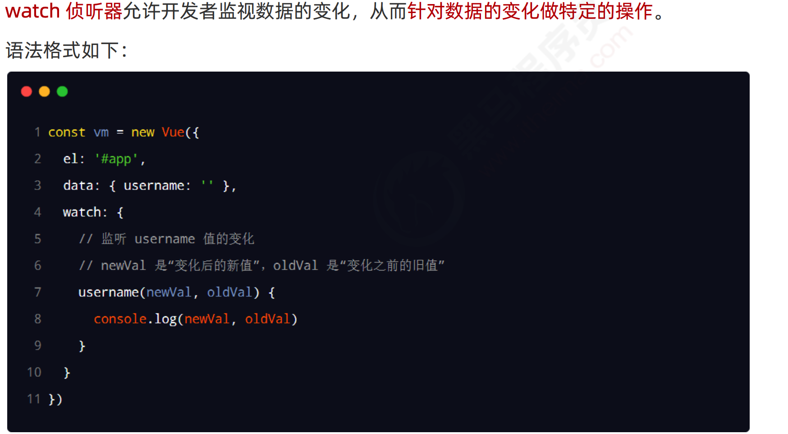
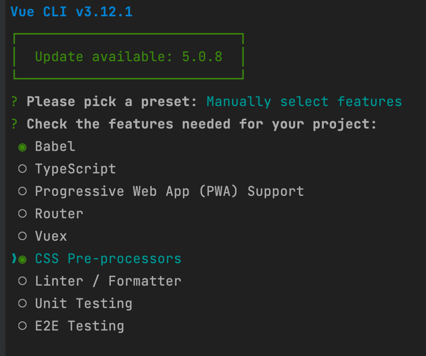

# Vue2_03


## 1.侦听器

### 1.1.什么是 watch 侦听器



### 1.2.使用 watch 检测用户名是否可用

```html
<body>
<div id="app">
    <input type="text" v-model="username">
</div>

<script src="./lib/vue-2.6.12.js"></script>
<script src="./lib/jquery-v3.6.0.js"></script>
<script src="./lib/axios.js"></script>

<script>
  const vm = new Vue({
    el: '#app',
    data: {
      username: 'admin'
    },
    // 所有的侦听器，都应该被定义到 watch 节点下
    watch: {
      /*/!*---------------Ajax------------------*!/
      // 侦听器本质上是一个函数，要监视哪个数据的变化，就把数据名作为方法名即可
      // 新值在前，旧值在后
      username(newVal) {
        if (newVal === '') return
        // 1. 调用 jQuery 中的 Ajax 发起请求，判断 newVal 是否被占用！！！
        $.get('https://www.escook.cn/api/finduser/' + newVal, function (result) {
          console.log(result)
        })
      },*/

      /*---------------axios------------------*/
      /*username(newVal) {
        if (newVal === '') return
        //axios调用
        axios.get('https://www.escook.cn/api/finduser/' + newVal).then(data => {
          const rest = data.res
          console.log(rest)
        }).catch(err => {
          console.error('err:', err)
        })
      },*/

      /*---------------axios异步函数------------------*/
      async username(newVal) {
        if (newVal === '') return
        //axios调用
        const { data:res } = await axios.get('https://www.escook.cn/api/finduser/' + newVal)
        console.info(res)
      },

    }
  })
</script>
</body>
```

[异步函数 async await关键字 - 小不点灬 - 博客园 (cnblogs.com)](https://www.cnblogs.com/ximenchuifa/p/13619406.html)

### 1.3.immediate 选项


### 1.4.deep 选项


### 1.5.监听对象单个属性的变化


## 2.计算属性

### 2.1. 什么是计算属性


不使用计算属性


 使用计算属性

```html
<body>
  <div id="app">
    <div>
      <span>R：</span>
      <input type="text" v-model.number="r">
    </div>
    <div>
      <span>G：</span>
      <input type="text" v-model.number="g">
    </div>
    <div>
      <span>B：</span>
      <input type="text" v-model.number="b">
    </div>
    <hr>

    <!-- 专门用户呈现颜色的 div 盒子 -->
    <!-- 在属性身上，: 代表  v-bind: 属性绑定 -->
    <!-- :style 代表动态绑定一个样式对象，它的值是一个 {  } 样式对象 -->
    <!-- 当前的样式对象中，只包含 backgroundColor 背景颜色 -->
    <div class="box" :style="{ backgroundColor: rgb }">
      {{ rgb }}
    </div>
    <button @click="show">按钮</button>
  </div>

  <script>
    // 创建 Vue 实例，得到 ViewModel
    var vm = new Vue({
      el: '#app',
      data: {
        // 红色
        r: 0,
        // 绿色
        g: 0,
        // 蓝色
        b: 0
      },
      methods: {
        // 点击按钮，在终端显示最新的颜色
        show() {
          console.log(this.rgb)
        }
      },
      // 所有的计算属性，都要定义到 computed 节点之下
      // 计算属性在定义的时候，要定义成“方法格式”
      computed: {
        // rgb 作为一个计算属性，被定义成了方法格式，
        // 最终，在这个方法中，要返回一个生成好的 rgb(x,x,x) 的字符串
        rgb() {
          return `rgb(${this.r}, ${this.g}, ${this.b})`
        }
      }
    });

    console.log(vm)
  </script>
</body>
```

### 2.2.计算属性特点

1. 定义的时候，要被定义为“方法”
2. 在使用计算属性的时候，当普通的属性使用即可

好处：

1. 实现了代码的复用
2. 只要计算属性中依赖的数据源变化了，则计算属性会自动重新求值！

## 3.vue-cli

### 3.1.什么是 vue-cli

vue-cli 是 Vue.js 开发的标准工具。它简化了程序员基于 webpack 创建工程化的 Vue 项目的过程。 引用自 vue-cli 官网上的一句话： 程序员可以专注在撰写应用上，而不必花好几天去纠结 webpack 配置的问题。 中文官网：https://cli.vuejs.org/zh/

### 3.2.安装和使用


查看@vue/cli版本


步骤





## 4.vue 组件


