# Vue2_04

## 1.组件的生命周期

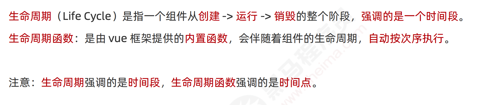

## 2.组件之间的数据共享

在项目开发中，组件之间的最常见的关系分为如下两种： ① 父子关系 ② 兄弟关系

### 2.1.父子组件之间的数据共享

① 父 -> 子共享数据

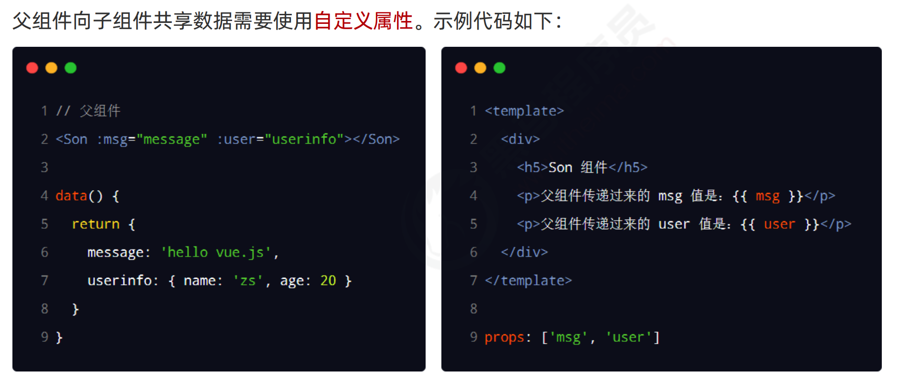

不要直接修改props(只读)，要修改转存data再改

② 子 -> 父共享数据

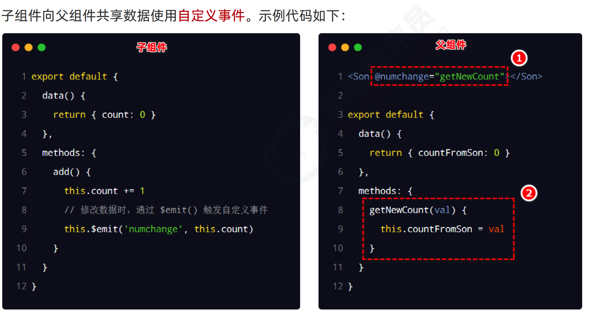

### 2.2.兄弟组件之间的数据共享

在 vue2.x 中，兄弟组件之间数据共享的方案是 EventBus

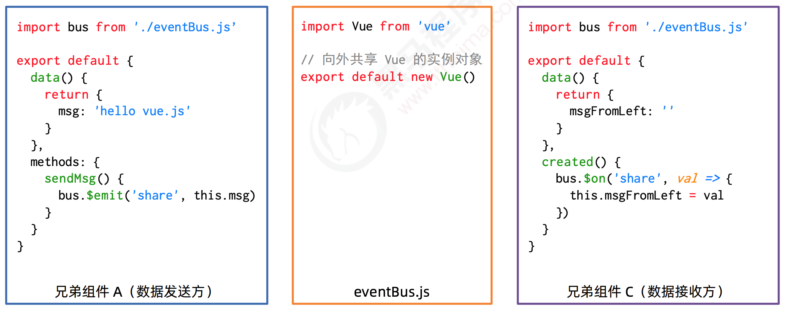

## 3.Vue基础总结

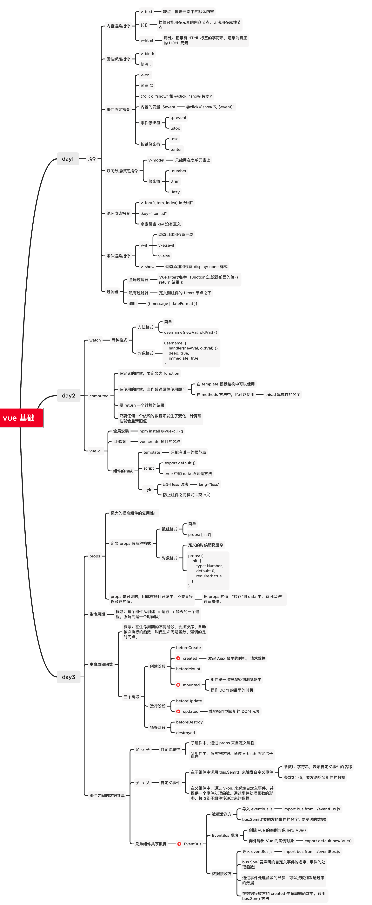

## 4.ref 引用

###    4.1.什么是 ref 引用

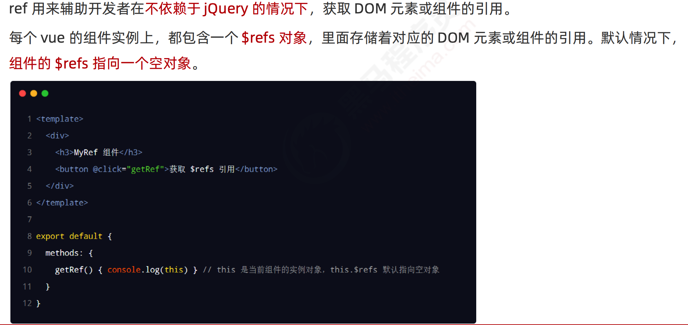

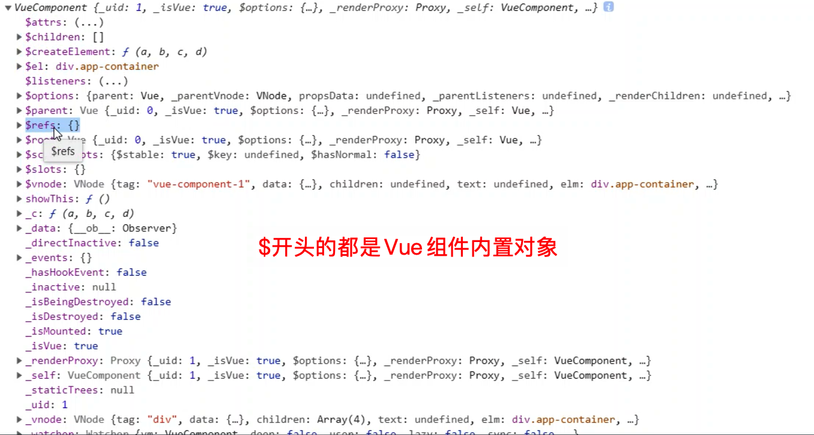

### 4.2.使用 ref 引用 DOM 元素

### 4.3.使用 ref 引用组件实例

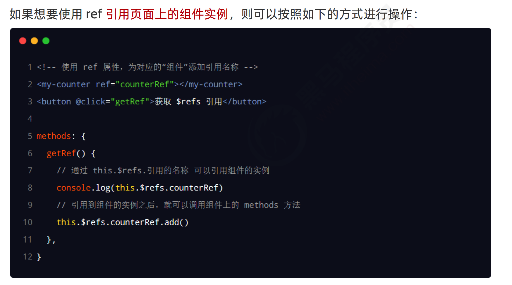

### 4.4.this.$nextTick(cb) 方法

控制文本框和按钮的按需切换

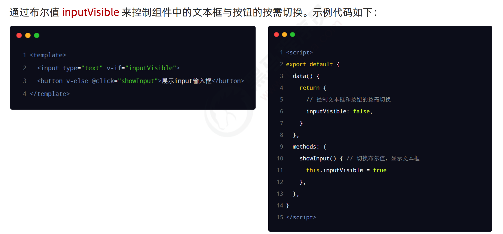

让文本框自动获得焦点

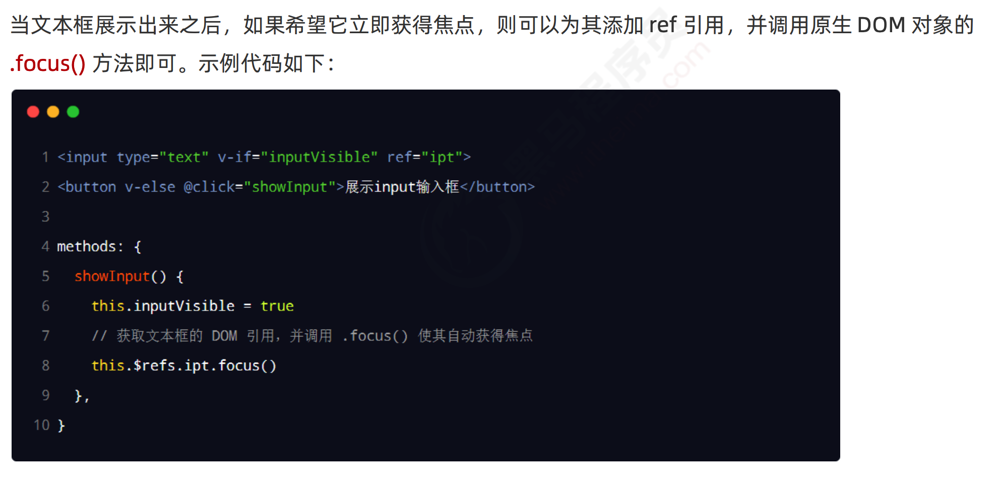

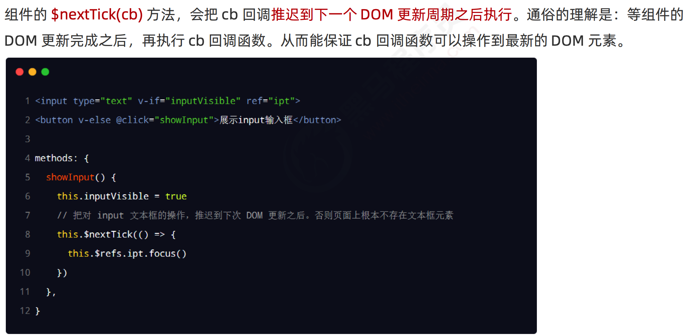

## 5.购物车案例