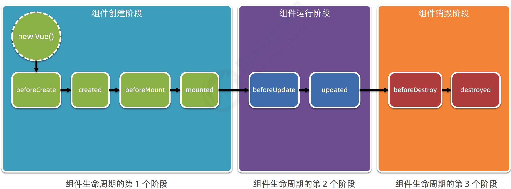
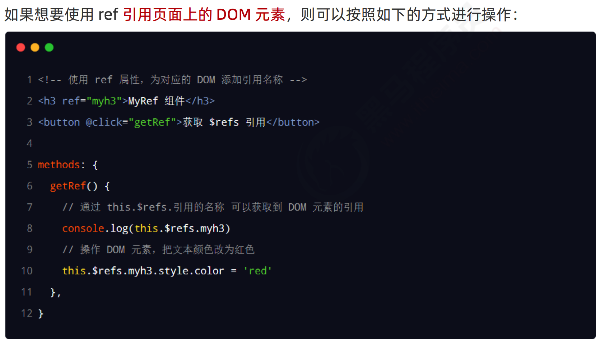
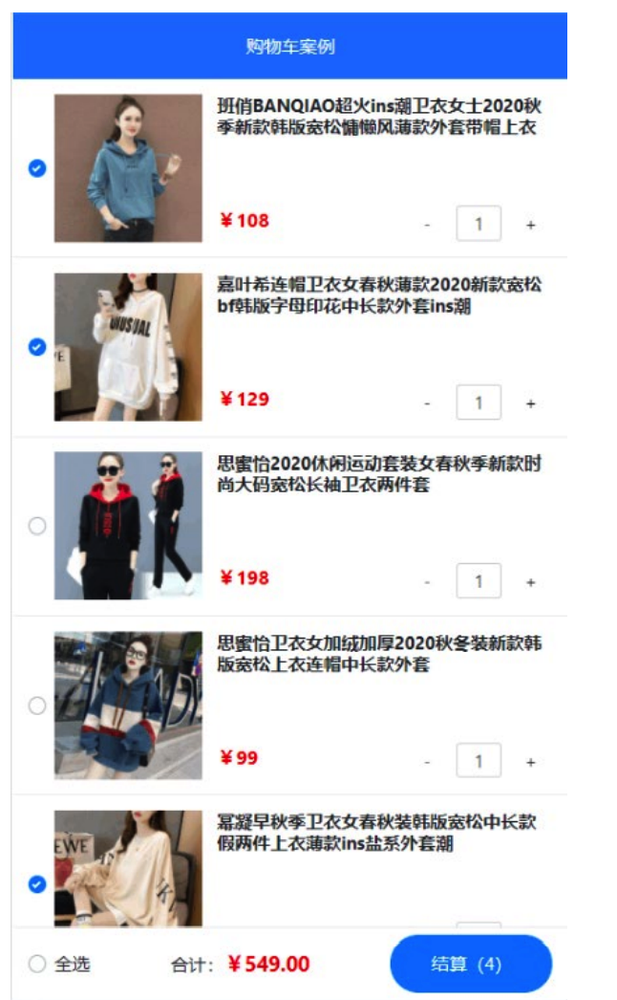
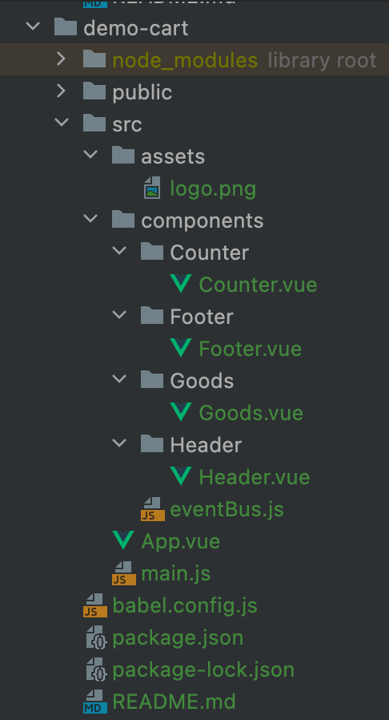

# Vue2_04

## 1.组件的生命周期

## 2.组件之间的数据共享

在项目开发中，组件之间的最常见的关系分为如下两种： ① 父子关系 ② 兄弟关系

### 2.1.父子组件之间的数据共享

① 父 -> 子共享数据

不要直接修改props(只读)，要修改转存data再改

② 子 -> 父共享数据

### 2.2.兄弟组件之间的数据共享

在 vue2.x 中，兄弟组件之间数据共享的方案是 EventBus

## 3.Vue基础总结

## 4.ref 引用

###    4.1.什么是 ref 引用

### 4.2.使用 ref 引用 DOM 元素

### 4.3.使用 ref 引用组件实例

### 4.4.this.$nextTick(cb) 方法

控制文本框和按钮的按需切换

让文本框自动获得焦点

## 5.购物车案例

案例效果

 实现步骤

① 初始化项目基本结构 

② 封装 MyHeader 组件 

③ 基于 axios 请求商品列表数据（ GET 请求，地址为 https://www.escook.cn/api/cart ） 

④ 封装 MyFooter 组件 

⑤ 封装 MyGoods 组件 

⑥ 封装 MyCounter 组件 总

