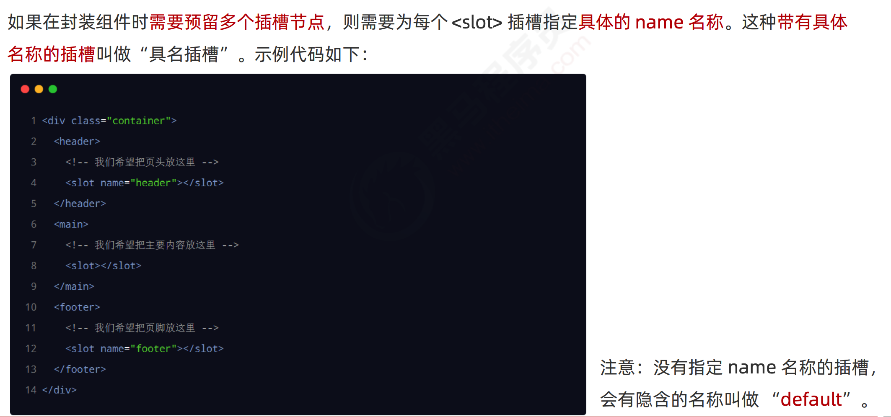

# Vue2_05


## 1.动态组件

### 1.1.实现动态组件渲染

动态组件指的是**动态切换组件的显示与隐藏**


### 1.2.keep-alive

使用 keep-alive 保持状态


keep-alive 对应的生命周期函数

```
// 当组件第一次被创建的时候，既会执行 created 生命周期，也会执行 activated 生命周期
// 当时，当组件被激活的时候，只会触发 activated 生命周期，不再触发 created。因为组件没有被重新创建
```


keep-alive 的 include 属性，通过 exclude 属性指定哪些组件不需要被缓存；但是：不要同时使用 include 和 exclude 这两个属性


## 2.插槽

插槽（Slot）是 vue 为组件的封装者提供的能力。允许开发者在封装组件时，把不确定的、希望由用户指定的 部分定义为插槽。


可以把插槽认为是组件封装期间，为用户预留的内容的占位符

### 2.1.插槽的基础用法


没有预留插槽的内容会被丢弃


后备内容


### 2.2.具名插槽



为具名插槽提供内容


<template>标签只起到包裹的作用，不会渲染成真是的元素

具名插槽的简写形式


### 2.3.作用域插槽

在封装组件的过程中，可以为预留的  插槽绑定 props 数据，这种带有 props 数据的  叫做“作用 域插槽”。


接收作用域插槽对外提供的数据


作用域插槽对外提供的数据对象，可以使用解构赋值简化数据的接收过程。


### 2.4.用插槽重构购物车案例


App.vue

```vue
<template>
  <div class="app-container">
    <!-- Header 头部区域 -->
    <Header title="购物车案例"></Header>
    <!-- 循环渲染每一个商品的信息 -->
    <Goods
      v-for="item in list"
      :key="item.id"
      :id="item.id"
      :title="item.goods_name"
      :pic="item.goods_img"
      :price="item.goods_price"
      :state="item.goods_state"
      @state-change="getNewState"
    >
      <Counter :num="item.goods_count" @num-change="getNewNum(item, $event)"></Counter>
    </Goods>

    <!-- Footer 区域 -->
    <Footer :isfull="fullState" :amount="amt" :all="total" @full-change="getFullState"></Footer>
  </div>
</template>

<script>
// 导入 axios 请求库
import axios from 'axios'
// 导入需要的组件
import Header from '@/components/Header/Header.vue'
import Goods from '@/components/Goods/Goods.vue'
import Footer from '@/components/Footer/Footer.vue'

// 导入 Counter 组件
import Counter from '@/components/Counter/Counter.vue'

export default {
  data() {
    return {
      // 用来存储购物车的列表数据，默认为空数组
      list: []
    }
  },
  // 计算属性
  computed: {
    // 动态计算出全选的状态是 true 还是 false
    fullState() {
      return this.list.every(item => item.goods_state)
    },
    // 已勾选商品的总价格
    amt() {
      // 1. 先 filter 过滤
      // 2. 再 reduce 累加
      return this.list
        .filter(item => item.goods_state)
        .reduce((total, item) => (total += item.goods_price * item.goods_count), 0)
    },
    // 已勾选商品的总数量
    total() {
      return this.list.filter(item => item.goods_state).reduce((t, item) => (t += item.goods_count), 0)
    }
  },
  created() {
    // 调用请求数据的方法
    this.initCartList()
  },
  methods: {
    // 封装请求列表数据的方法
    async initCartList() {
      // 调用 axios 的 get 方法，请求列表数据
      const { data: res } = await axios.get('https://www.escook.cn/api/cart')
      // 只要请求回来的数据，在页面渲染期间要用到，则必须转存到 data 中
      if (res.status === 200) {
        this.list = res.list
      }
    },
    // 接收子组件传递过来的数据
    // e 的格式为 { id, value }
    getNewState(e) {
      this.list.some(item => {
        if (item.id === e.id) {
          item.goods_state = e.value
          // 终止后续的循环
          return true
        }
      })
    },
    // 接收 Footer 子组件传递过来的全选按钮的状态
    getFullState(val) {
      this.list.forEach(item => (item.goods_state = val))
    },
    // 获取 Counter 组件发过来的最新的数量值
    getNewNum(item, e) {
      // console.log(item, e)
      item.goods_count = e
    }
  },
  components: {
    Header,
    Goods,
    Footer,
    Counter
  }
}
</script>

<style lang="less" scoped>
.app-container {
  padding-top: 45px;
  padding-bottom: 50px;
}
</style>
```

Good.vue

```vue
<template>
  <div class="goods-container">
    <!-- 左侧图片 -->
    <div class="thumb">
      <div class="custom-control custom-checkbox">
        <!-- 复选框 -->
        <input type="checkbox" class="custom-control-input" :id="'cb' + id" :checked="state" @change="stateChange"/>
        <label class="custom-control-label" :for="'cb' + id">
          <!-- 商品的缩略图 -->
          
        </label>
      </div>
    </div>
    <!-- 右侧信息区域 -->
    <div class="goods-info">
      <!-- 商品标题 -->
      <h6 class="goods-title">{{ title }}</h6>
      <div class="goods-info-bottom">
        <!-- 商品价格 -->
        <span class="goods-price">￥{{ price }}</span>
        <!-- 商品的数量 -->
        <slot></slot>
      </div>
    </div>
  </div>
</template>

<script>
export default {
  props: {
    // 商品的 id
    // 为啥在这里要封装一个 id 属性呢？
    // 原因:将来,子组件中商品的勾选状态变化之后, 需要通过子 -> 父的形式,
    // 通知父组件根据 id 修改对应商品的勾选状态。
    id: {
      required: true,
      type: Number
    },
    // 要渲染的商品的标题
    title: {
      default: '',
      type: String
    },
    // 要渲染的商品的图片
    pic: {
      default: '',
      type: String
    },
    // 商品的单价
    price: {
      default: 0,
      type: Number
    },
    // 商品的勾选状态
    state: {
      default: true,
      type: Boolean
    }
  },
  methods: {
    // 只要复选框的选中状态发生了变化，就会调用这个处理函数
    stateChange(e) {
      const newState = e.target.checked
      // 触发自定义事件
      this.$emit('state-change', {id: this.id, value: newState})
    }
  }
}
</script>

<style lang="less" scoped>
.goods-container {
  + .goods-container {
    border-top: 1px solid #efefef;
  }

  padding: 10px;
  display: flex;

  .thumb {
    display: flex;
    align-items: center;

    img {
      width: 100px;
      height: 100px;
      margin: 0 10px;
    }
  }

  .goods-info {
    display: flex;
    flex-direction: column;
    justify-content: space-between;
    flex: 1;

    .goods-title {
      font-weight: bold;
      font-size: 12px;
    }

    .goods-info-bottom {
      display: flex;
      justify-content: space-between;

      .goods-price {
        font-weight: bold;
        color: red;
        font-size: 13px;
      }
    }
  }
}
</style>
```

Count.vue

```vue
<template>
  <div class="number-container d-flex justify-content-center align-items-center">
    <!-- 减 1 的按钮 -->
    <button type="button" class="btn btn-light btn-sm">-</button>
    <!-- 购买的数量 -->
    <span class="number-box">{{ num }}</span>
    <!-- 加 1 的按钮 -->
    <button type="button" class="btn btn-light btn-sm" @click="add">+</button>
  </div>
</template>

<script>
export default {
  props: {
    // 要展示的商品的数量
    num: {
      type: Number,
      default: 1
    }
  },
  methods: {
    add() {
      // 通过自定义事件的方法，把最新的数量值，发给父组件
      this.$emit('num-change', this.num + 1)
    }
  }
}
</script>

<style lang="less" scoped>
.number-box {
  min-width: 30px;
  text-align: center;
  margin: 0 5px;
  font-size: 12px;
}

.btn-sm {
  width: 30px;
}
</style>
```

## 3.自定义指令

vue 官方提供了 v-text、v-for、v-model、v-if 等常用的指令。除此之外 vue 还允许开发者自定义指令

vue 中的自定义指令分为两类，分别是： ⚫ 私有自定义指令 ⚫ 全局自定义指令

### 3.1.私有自定义指令


### 3.2.为自定义指令动态绑定参数值


在声明自定义指令时，可以通过形参中的第二个参数，来接收指令的参数值


### 3.3.update 函数


如果 bind 和update 函数中的逻辑完全相同，则对象格式的自定义指令可以简写成函数格式

```vue
directives: {
	color(el, binding) {
		el.style.color = binding.value
	}
}
```

### 3.4.全局自定义指令

main.js中加入


### 3.5.axios使用优化

mian.js

```js
import Vue from 'vue'
import App from './App.vue'
import axios from 'axios'

Vue.config.productionTip = false

// 全局配置 axios 的请求根路径
axios.defaults.baseURL = 'http://www.liulongbin.top:3006'
// 把 axios 挂载到 Vue.prototype 上，供每个 .vue 组件的实例直接使用
Vue.prototype.$http = axios

// 今后，在每个 .vue 组件中要发起请求，直接调用 this.$http.xxx
// 但是，把 axios 挂载到 Vue 原型上，有一个缺点：不利于 API 接口的复用！！！

new Vue({
  render: h => h(App)
}).$mount('#app')
```

Right.vue

```vue
<template>
  <div class="right-container">
    <h3>Right 组件</h3>
    <button @click="postInfo">发起 POST 请求</button>
    <button @click="btnGetBooks">获取图书列表的数据</button>
  </div>
</template>

<script>
// import axios from 'axios'

export default {
  methods: {
    async postInfo() {
      const { data: res } = await this.$http.post('/api/post', { name: 'zs', age: 20 })
      console.log(res)
    },
    // 点击按钮，获取图书列表的数据
    async btnGetBooks() {
      const { data: res } = await this.$http.get('/api/getbooks')
      console.log(res)
    }
  }
}
</script>

<style lang="less" scoped>
.right-container {
  background-color: skyblue;
  min-height: 200px;
  flex: 1;
}
</style>
```